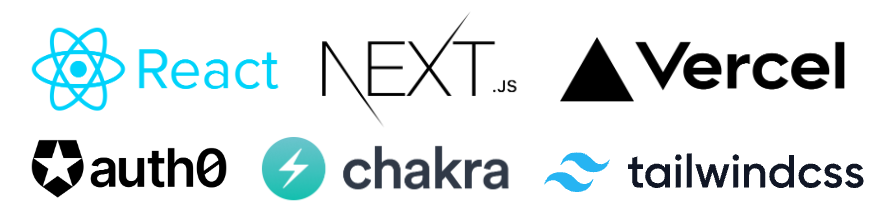
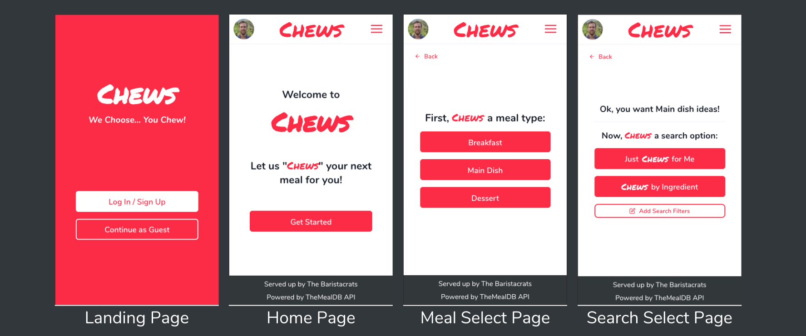
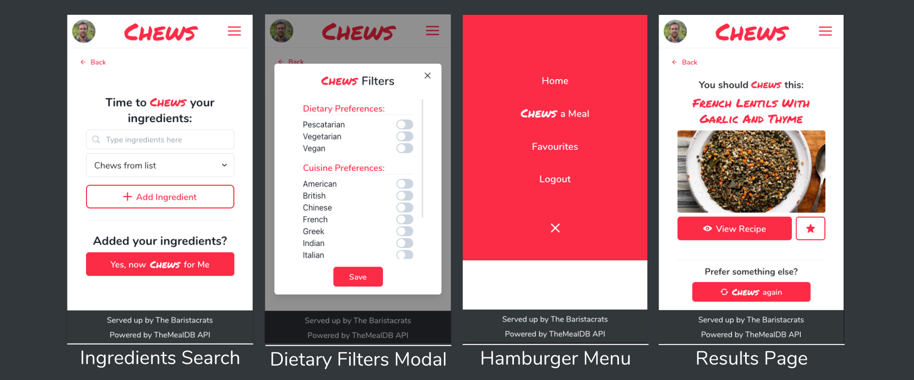
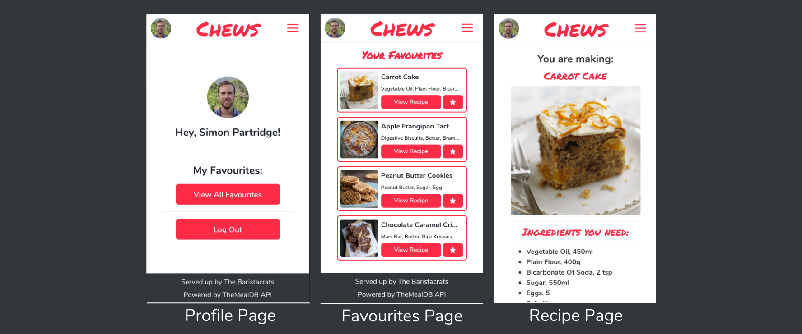

---

This README file covers details of the front-end repo for Chews app, as well as a project summary. To view the corresponding back-end repo, please click [here](https://github.com/AdamPhasey/baristacrats-backend-repo).

---

## Index

- [Project Description](#project-description)
- [Skills & Lessons](#skills--lessons)
- [Future Plans/Roadmap](#future-plansroadmap)
- [Front-End Tools](#front-end-tools)
- [Dev Manual](#dev-manual)
- [User Guide](#user-guide)
- [App Screenshots](#app-screenshots)
- [Color and Font References](#color-and-font-references)
- [Support and Feedback](#support-and-feedback)

---

## Project Description

Chews is a mobile-first web app created by [Simon Partridge](https://github.com/simonpartridge86), [Adam Phasey](https://github.com/AdamPhasey), [Sam Wylie](https://github.com/samsonhumber), [Maurizio Monti](https://github.com/mauriziomonti), [Kunal Shukla](https://github.com/kun-shukla) and [Mino Devito](https://github.com/MagicMino) during our final project month at [School of Code](https://www.schoolofcode.co.uk/) bootcamp. We were challenged to come up with an app that solves any problem of our choice in a four-week challenge.

The problem we identified was decision fatigue around meal/recipe selection, which has been exacerbated by the increased amount of home-cooking during the COVID pandemic and the 2022 cost-of-living crisis. This problem can result in a lack of inspiration in the kitchen and sap the joy out of cooking.

The resulting app, "Chews" is a web app that helps users quickly and easily find a recipe suggestion for their next meal, either at random or based on ingredients in their pantry, greatly reducing any research or decision-making on their part.

Please view the app in deployment here: [chews.vercel.app](https://chews.vercel.app/)

---

## Skills & Lessons

This was our second experience of a group project at School of Code, and aimed to apply knowledge gained throughout School of Code bootcamp, as well as getting further experience of the following skills:

- Broadening our horizons with additional technologues outside of the bootcamp curriculum scope.
- Agile methodologies and tools
- Project planning & management
- UX/UI design processes
- Cooperation and decision making in a larger dev team

Having reflected on the project week as a team, we believe that our strengths included:

- A strong team manifesto that gave us clear processes for handling decisions and conflict, which helped all members feel comfortable in the team.
- Taking swift and decisive action at certain points in the project when significant changes in direction were needed, particularly when previous decisions needed to be revisited or revised, which was enabled by our Agile project management approach.
- Reaching out for external help from mentors when we lacked expertise regarding certain coding issues, and from peers when we wanted extra feedback on our ongoing design decisions.

Lessons to take forward to future projects:

- Time-blocking is hard! As a team, we got better at predicting how long certain coding tickets would take as we became more familiar with each others work pace and expertise, but further room for improvement remains.
- Reliance on external third-party APIs for data fetching is ultimately risky, so we learned a lot (with guidance) about how to keep backend design RESTful and reliable, and how to limit such risks.
- UI libraries and CSS frameworks can take a lot of the hassle and hard work out of styling attractive, highly functional, and responsive components, and our project benefitted from their use.

---

## Future Plans/Roadmap

We have planned to add the following functionality in future sprints:

- Add additional dietary requirement filters, prioritising allergies
- Add functionality to allow crowd-sourced/user-posted recipes, which would reduce reliance on external meal API.
- Add dynamic update of recipe when making a different number of portions.
- Add budget category, so users can select from lower or higher budget recipes.
- Add functionality for users to share recipes on social media/whatsapp, etc.
- Add Dark Mode for reduced eye strain.

---

## Front-End Tools



In addition to consolidating our knowledge of various technologies learned during the School of Code bootcamp, such as, React and Auth0, we also elected to use a number of tools that were new to us, namely, Next.js, Vercel, Chakra UI and Tailwind CSS:

- Next.js was selected for its improved SEO and performance, dynamic routing, and server-side rendering and pre-fetching.
- Vercel was used as the favoured deployment option for Next.js apps.
- Chakra UI was used for its simple-to-use and highly functional modular components, which enhanced the appearance and functionality of our app and reduced development time.
- Tailwind CSS was selected for convenient styling of custom components and responsive layouts.

---

## Dev Manual

The app can be viewed in deployment [here](https://chews.vercel.app/).

Alternatively, the front-end can be run locally, as follows:

(For details on also running the backend locally, please navigate [here](https://github.com/AdamPhasey/baristacrats-backend-repo))

Clone the project front-end and back-end repos separately:

```bash
  git clone https://github.com/simonpartridge86/baristacrats-frontend-final-project.git
```

Navigate into the relevant folder and run the following terminal commands:

```bash
  npm install
  npm start
```

The app will automatically run on http://localhost:3000 by default, or the next available port otherwise.

---

## User Guide

For a short demonstration of the app, including a short introduction from our team members, please watch [this Youtube video](https://youtu.be/vULfbCpL3NU)

---

## App Screenshots





---

## Color and Font References

| Color                    | Hex                                        |
| ------------------------ | ------------------------------------------ |
| <span>Chews Red</span>   | <span style="color:#FD2B46">#FD2B46</span> |
| <span>Chews Black</span> | <span style="color:#32373B">#32373B</span> |
| <span>Chews White</span> | <span style="color:#FFFFFF">#FFFFFF</span> |

Header font - [Permanent Marker](https://fonts.adobe.com/fonts/permanent-marker)

Main text font - [Nunito](https://fonts.adobe.com/fonts/nunito)

---

## Support and Feedback

To receive support or give feedback, please contact team members through the details provided on their Github profiles:

[Simon Partridge](https://github.com/simonpartridge86),
[Adam Phasey](https://github.com/AdamPhasey),
[Sam Wylie](https://github.com/samsonhumber),
[Maurizio Monti](https://github.com/mauriziomonti),
[Kunal Shukla](https://github.com/kun-shukla),
[Mino Devito](https://github.com/MagicMino)

[--Return to Index](#index)
